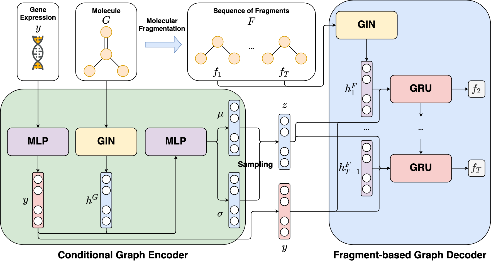

SDM 2022 submission's code

# FAME - Fragment-based Conditional Molecular Generation for Phenotypic Drug Discovery
-----------------------------------------------------------------

## 1. Introduction
**FAME** is a Python implementation of the deep graph generative model targeting phenotypic molecular design, in particular gene expression-based molecular design. **FAME** leverages a conditional variational autoencoder framework to learn the conditional distribution generating molecules from gene expression profiles. To tackle the difficulties when learning this distribution due to the complexity of the molecular space and the noisy phenomenon in gene expression data, first, a gene expression denoising (GED) model using constrative objective function is proposed to reduce noise from gene expression data before inputting to **FAME**. Second, **FAME** is designed to treat molecules as the sequences of fragments and then learn to generate these fragments in autoregressive manner. By leveraging this fragment-based generation strategy and the denoised gene expression profiles, **FAME** can generate novel molecules with a high validity rate and desired biological activity. 


The experimental results show that **FAME** outperforms existing methods including both SMILES-based and graph-based deep generative models for phenotypic molecular design. Furthermore, the effective mechanism for reducing noise in gene expression data proposed in our study can be applied and then adds more values to other phenotypic drug discovery applications.

## 3. FAME



Figure 1: Overall architecture of **FAME**

## 4. Installation

**FAME** depends on numpy, scipy, pandas, tqdm, scikit-learn, rdkit, PyTorch Geometric, and PyTorch (CUDA toolkit if use GPU).
You must have them installed before using **FAME**.

The simple way to install them is using conda:

```sh
$ conda create -n fame python=3.7
$ conda activate fame
$ conda install numpy scipy pandas tqdm scikit-learn
$ conda install pytorch torchvision torchaudio cudatoolkit=11.1 -c pytorch-lts -c nvidia
$ conda install -c conda-forge rdkit
$ conda install pyg -c pyg -c conda-forge
```

Note that the command for pytorch installation depends on your environment. Please visit [PyTorch Homepage](https://pytorch.org/get-started/locally/) for more details.
## 5. Usage

### 5.1. Data

To download preprocessed datasets used in our experiments (i.e., LINCS L1000, ChemBL, Excape), please run the following script.

```sh
$ bash data_download.sh 
```

### 5.2. Training FAME

The training script for **FAME** is located at the main folder.

```sh
$ python train.py 
```
